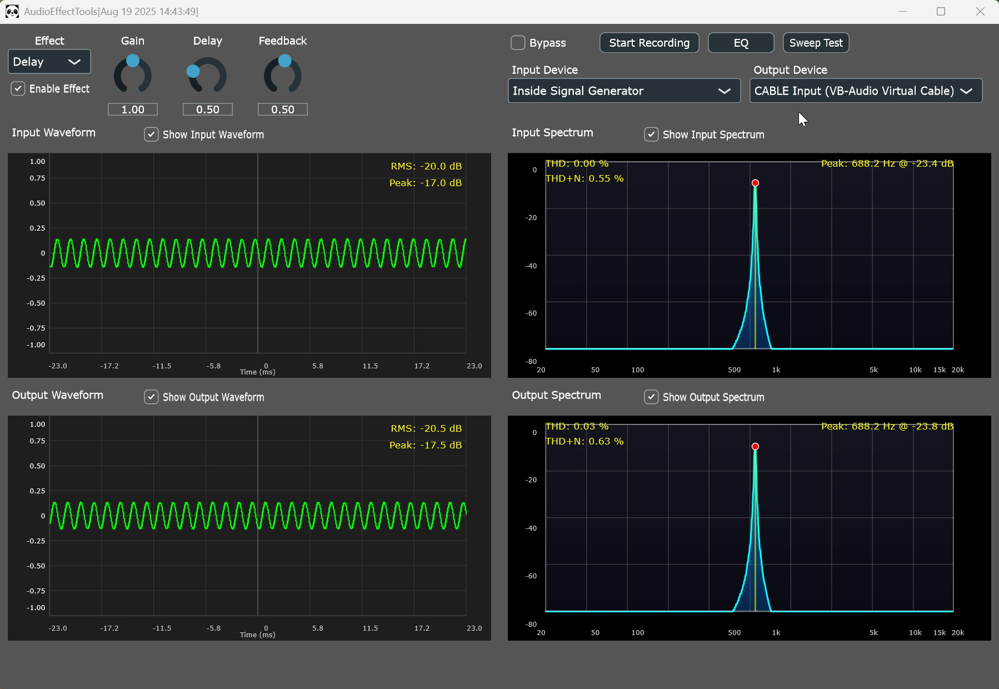
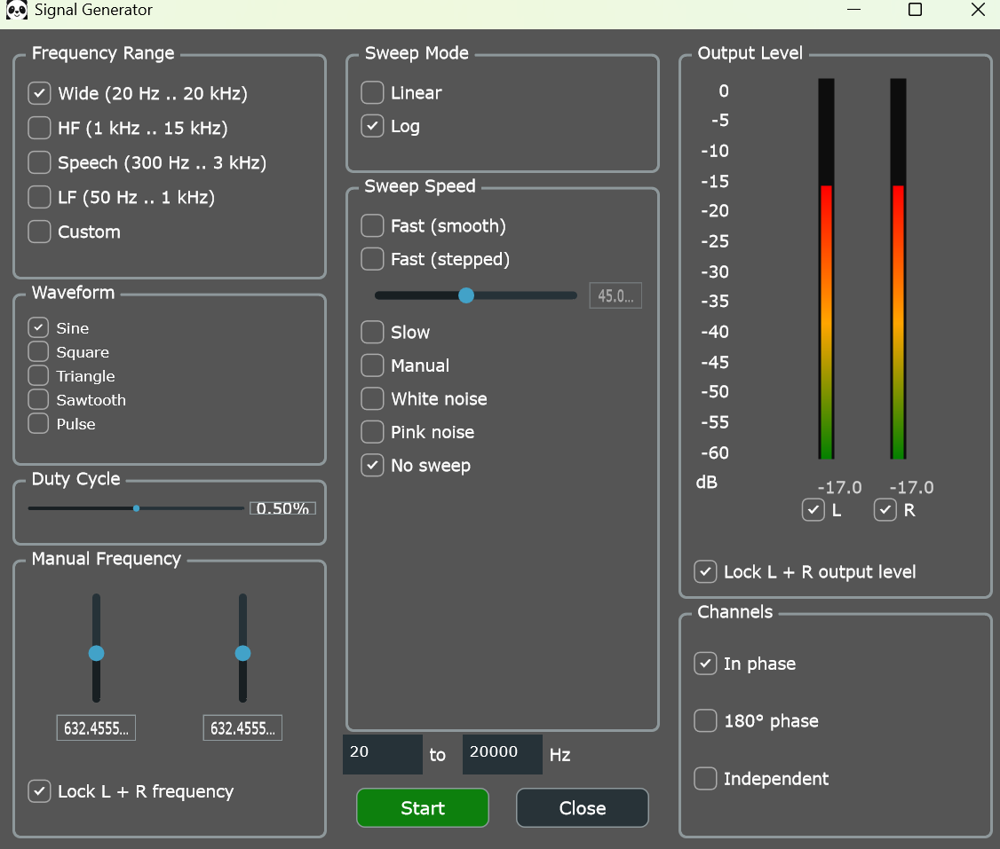
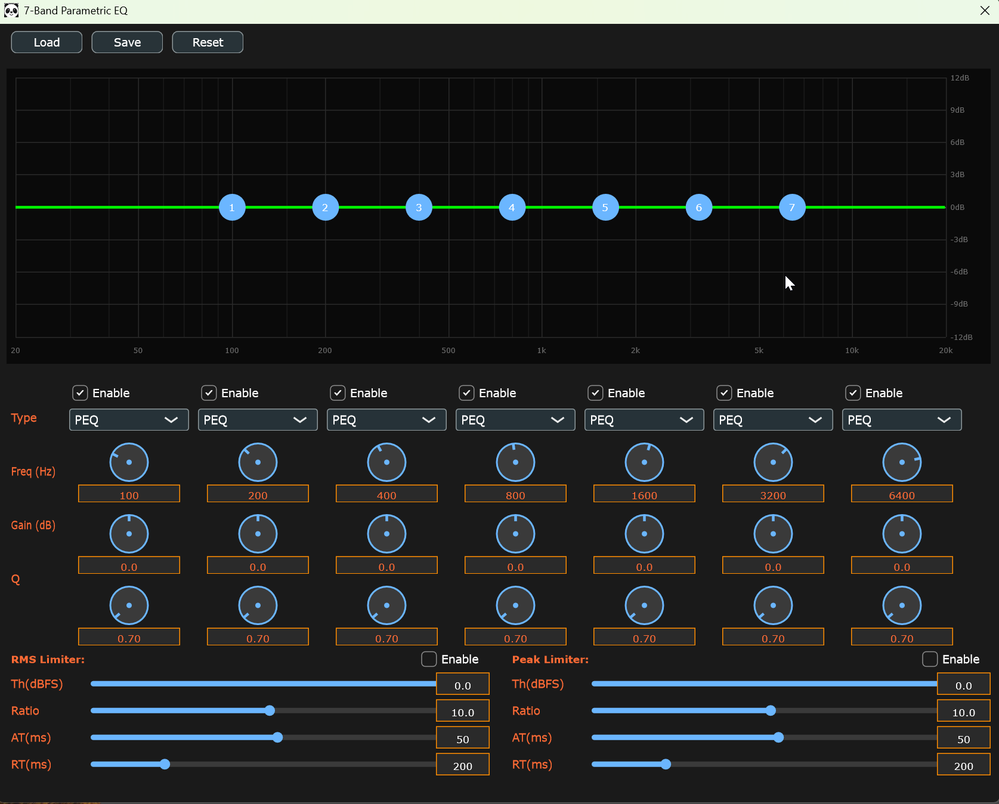

# AudioEffectTools - Professional Real-time Audio Processing Suite

## Overview
AudioEffectTools is a comprehensive real-time audio effects processing and analysis application built with the JUCE framework. It provides professional-grade audio effects, real-time visualization, signal generation, and advanced analysis tools for audio engineers, musicians, and researchers.

## Key Features

### 🎛️ Audio Effects Processing
- **11 Professional Effects**: Including both custom implementations and JUCE DSP effects
- **Real-time Processing**: Low-latency audio processing with bypass functionality
- **Stereo Processing**: Full stereo support for all effects
- **Parameter Control**: Intuitive rotary sliders with real-time parameter updates

### 📊 Advanced Visualization
- **Dual Spectrum Analyzers**: Real-time FFT analysis for input and output signals
- **Dual Waveform Analyzers**: Time-domain visualization with RMS and peak detection
- **Interactive Controls**: Toggle visibility and zoom controls for all analyzers

### 🎵 Signal Generation & Testing
- **Internal Signal Generator**: Built-in signal source with multiple waveform types
- **Sweep Test Generator**: Automated frequency sweep testing with analysis
- **Audio Recording**: Record input/output audio with automatic file naming

### 🎚️ Advanced Audio Processing
- **7-Band Parametric EQ**: Professional EQ with graphical interface
- **Limiter/Compressor**: Dynamic range control with adjustable parameters
- **Device Management**: Flexible input/output device selection

## AudioEffectTools

[](https://github.com/taberhuang/AudioEffectTools/actions/workflows/build_msvc.yml)
[](https://github.com/taberhuang/AudioEffectTools/releases)
[](https://github.com/taberhuang/AudioEffectTools/blob/main/LICENSE)
[](https://github.com/taberhuang/AudioEffectTools)
[](https://juce.com)

## Program Architecture

### Core Components

```
AudioEffectTools/
├── Source/
│   ├── Main.cpp                     # Application entry point
│   ├── MainComponent.h/.cpp         # Main application controller
│   ├── MainComponentLayout.cpp      # UI layout management
│   ├── MainComponentCallbacks.cpp   # Event handling & user interactions
│   ├── MainComponentEffects.cpp     # Mono effect processing
│   ├── MainComponentEffectsStereo.cpp # Stereo effect processing
│   │
│   ├── Analysis & Visualization/
│   │   ├── SpectrumAnalyzer.h/.cpp  # FFT-based frequency analysis
│   │   └── WaveformAnalyzer.h/.cpp  # Time-domain visualization
│   │
│   ├── EffectEmbeded/               # Custom C implementations
│   │   ├── effect_delay.h/.c        # Custom delay effect
│   │   ├── effect_cathedral_reverb.h/.c # Custom cathedral reverb
│   │   ├── project_common.h         # Common definitions
│   │   └── project_config.h         # Configuration settings
│   │
│   ├── EffectJUCE/                  # JUCE DSP implementations
│   │   ├── IIRFilterProcessor.h/.cpp  # 7-band parametric EQ
│   │   └── LimiterProcessor.h/.cpp    # Dynamic range control
│   │
│   ├── EffectExternal/              # External effects (RNNoise)
│   │   ├── NoiseSuppressionProcessor.h/.cpp   # Wrapper & parameters
│   │   └── RnNoiseEffectPlugin.h/.cpp         # RNNoise integration
│   │
│   ├── RNNoise/                     # Bundled RNNoise runtime sources
│   │   ├── denoise.c, rnn.c, nnet.c, nnet_default.c, pitch.c
│   │   ├── kiss_fft.c, celt_lpc.c, rnnoise_tables.c
│   │   └── rnnoise_data_little.c    # Little-endian model data for Windows
│   │   # Excluded tools: dump_*.c, write_weights.c, x86/* (SSE/AVX)
│   │
│   ├── EQWindow/                    # Parametric EQ interface
│   │   ├── EQWindow.h/.cpp          # Main EQ window
│   │   ├── EQControls.h/.cpp        # EQ parameter controls
│   │   └── FrequencyResponseDisplay.h/.cpp # Visual frequency response
│   │
│   ├── SignalGeneratorWindow/       # Internal signal generation
│   │   ├── SignalGenWindow.h        # Signal generator window
│   │   ├── SignalGeneratorComponent.h/.cpp # UI components
│   │   ├── SignalGeneratorCore.h/.cpp # Core signal generation
│   │   └── AudioEngine.h/.cpp       # Audio processing engine
│   │
│   ├── SweepTestWindow/             # Frequency response testing
│   │   ├── SweepTestGenerator.h/.cpp  # Automated sweep generation
│   │   └── SweepTestAnalyzer.h/.cpp   # Frequency response analysis
│   │
│   ├── Utilities/
│   │   ├── AudioRecorder.h/.cpp     # Audio recording functionality
│   │   └── Utils.h                  # Helper functions & utilities
│   │
│   └── Resources/
│       ├── icon.ico/.png            # Application icons
│       └── [Binary resources]       # Embedded resources
│
├── Builds/VisualStudio2022/         # Visual Studio project files
│   ├── AudioEffectTools.sln         # Solution file
│   ├── AudioEffectTools_App.vcxproj # Project file
│   └── eq_limiter_params.json       # EQ/Limiter presets
│
├── JuceLibraryCode/                 # JUCE framework integration
│   ├── JuceHeader.h                 # Main JUCE header
│   └── [JUCE modules]               # Framework modules
│
└── Configuration Files/
    ├── AudioEffectTools.jucer       # JUCE project configuration
    ├── CMakeLists.txt               # Auto-generated CMake build (DO NOT EDIT MANUALLY)
    ├── generate_cmake_from_vcxproj.py # CMake generator script
    └── build_and_run.bat            # Automated build script
```
## 🖼️ Screenshots



### Audio Processing Pipeline

```
Input Source → Effect Processing → EQ → Limiter → Output
     ↓              ↓              ↓       ↓        ↓
Signal Gen    Parameter Control   GUI   Analysis  Recording
     ↓              ↓              ↓       ↓        ↓
Sweep Test    Real-time Update   Visual Feedback  File Save
```

## Available Effects

### Custom Effects (EffectEmbeded)
1. **Delay**: Classic delay with feedback control
   - Parameters: Delay Time (0-2s), Feedback (0-0.95)
   - Features: Stereo processing, adjustable feedback loop

2. **Cathedral Reverb**: Spacious reverb simulation
   - Parameters: Decay (0-1), Tone (0-1)
   - Features: Large space simulation, tone shaping

3. **Noise Suppression (RNNoise)**: Real-time voice denoising powered by RNNoise
   - Parameters: VAD Threshold (0.0–1.0), VAD Grace Period (ms), Retroactive VAD Grace (ms)
   - Features: Probabilistic VAD-based gating to preserve speech while suppressing noise; retroactive onset protection (may add latency); optimized for 48 kHz, 10 ms frames; attribution: [xiph/rnnoise](https://github.com/xiph/rnnoise)

### JUCE DSP Effects
3. **JUCE Delay**: Professional delay line
   - Parameters: Time (0-2000ms), Feedback (0-0.95), Mix (0-1)

4. **JUCE Chorus**: Rich chorus effect
   - Parameters: Rate (0.1-10Hz), Depth (0-1), Centre Delay (1-50ms), Feedback (0-0.95), Mix (0-1)

5. **JUCE Reverb**: Standard reverb
   - Parameters: Room Size (0-1), Damping (0-1), Wet Level (0-1), Dry Level (0-1), Width (0-1)

6. **JUCE Phaser**: Phase modulation effect
   - Parameters: Rate (0.1-10Hz), Depth (0-1), Centre Freq (200-2000Hz), Feedback (0-0.95), Mix (0-1)

7. **JUCE Compressor**: Dynamic range control
   - Parameters: Threshold (-60-0dB), Ratio (1-20:1), Attack (0.1-100ms), Release (1-1000ms)

8. **JUCE Distortion**: Harmonic distortion
   - Parameters: Drive (0-1), Range (0-1), Blend (0-1)

### Additional Processing
9. **7-Band Parametric EQ**: Professional equalization
   - Frequency bands: 60Hz, 170Hz, 350Hz, 1kHz, 3.5kHz, 10kHz, 16kHz
   - Controls: Gain, Q factor per band

10. **Limiter**: Peak limiting and dynamic control
    - Parameters: Threshold, ratio, attack, release times

## Installation & Setup

### System Requirements
- **Operating System**: Windows 10/11 (x64)
- **Development Environment**: Visual Studio 2022 Community Edition
- **Audio Interface**: Built-in or external audio device
- **Memory**: 4GB RAM minimum, 8GB recommended
- **CPU**: Multi-core processor recommended for real-time processing

### Build Instructions

1. **Clone Repository**
   ```bash
   git clone https://github.com/taberhuang/AudioEffectTools.git
   cd AudioEffectTools
   # Use shallow clone for JUCE to avoid large download (JUCE is ~500MB+)
   git submodule update --init --depth 1 JUCE
   ```

2. **Open Project**
   - Launch Visual Studio 2022
   - Open `Builds/VisualStudio2022/AudioEffectTools.sln`

3. **Build Configuration**
   - Select **Release** configuration for optimal performance
   - Select **x64** platform
   - Build Solution (Ctrl+Shift+B)

4. **Run Application**
   - Set as startup project
   - Press F5 to run

### Quick Build Script (Recommended)

- Purpose: Auto-generate/update CMakeLists (includes JUCE) and build/run.
- The generated `CMakeLists.txt` is **AUTO-GENERATED** by `generate_cmake_from_vcxproj.py` - do not edit manually
- Usage:
```bash
python generate_cmake_from_vcxproj.py
build_and_run.bat
```
- Note: If the project structure changes, re-run `generate_cmake_from_vcxproj.py`.
- Alternative (CMakeLists.txt already exists):
```bash
build_and_run.bat
```

#### build_and_run.bat parameters

- Commands:
  - `build` (default): Incremental build, then run
  - `rebuild`: Clean and build, then run
  - `clean`: Remove build directory only
  - `run`: Run last built executable without building
  - `help`: Show usage
- Arguments:
  - `configuration`: `Debug` or `Release` (default: `Debug`)
  - `target`: Executable target name to run (optional)
- Examples:
```bash
build_and_run.bat                     # Build Debug incrementally and run
build_and_run.bat build Release       # Build Release and run
build_and_run.bat rebuild             # Clean, build Debug, run
build_and_run.bat run MyApp           # Run specific target without building
```

## Usage Guide

### Basic Operation

1. **Launch Application**
   - Run the executable or use Visual Studio
   - The main window displays all controls and analyzers

2. **Audio Device Setup**
   - Select input device from dropdown (including "Inside Signal Generator")
   - Select output device from dropdown
   - Devices are automatically detected and listed

3. **Effect Processing**
   - Choose effect from the Effect dropdown menu
   - Adjust parameters using rotary sliders
   - Use "Enable Effect" toggle to enable/disable processing
   - Use "Bypass" toggle for A/B comparison

4. **Signal Analysis**
   - Toggle spectrum analyzers for frequency domain analysis
   - Toggle waveform analyzers for time domain visualization
   - Observe real-time input vs. output comparison

### Advanced Features

#### Signal Generation
- Click "Signal Generator" to open internal signal source
- Generate sine waves, noise, sweeps for testing
- Use "Inside Signal Generator" as input device

#### Sweep Testing
- Click "Sweep Test" to perform automated frequency response analysis
- Generates 20Hz-20kHz sweep and records system response
- Automatically opens analysis window with results

#### EQ Processing
- Click "EQ" button to open parametric equalizer
- Adjust 7 frequency bands with visual feedback
- Real-time frequency response display

#### Audio Recording
- Click "Start Recording" to record input/output audio
- Files saved with timestamp in current directory
- Supports WAV format with automatic naming

### Parameter Controls

#### Effect Parameters
Each effect has specific parameters accessible via rotary sliders:
- **Delay**: Time, Feedback, Mix (for JUCE version)
- **Reverb**: Room Size, Damping, Wet/Dry levels
- **Modulation Effects**: Rate, Depth, Centre frequency
- **Dynamics**: Threshold, Ratio, Attack, Release times

#### Visualization Controls
- **Spectrum Analyzers**: Show/hide input and output frequency analysis
- **Waveform Analyzers**: Show/hide input and output time domain signals
- **Peak Detection**: Automatic peak frequency identification
- **Zoom Controls**: Mouse wheel zoom in waveform displays

## Development Architecture

### Code Organization

#### Main Components
- **MainComponent.h/.cpp**: Core application logic and audio processing
- **MainComponentLayout.cpp**: UI layout and positioning
- **MainComponentCallbacks.cpp**: Event handling and user interactions
- **MainComponentEffects.cpp**: Effect processing implementations
- **MainComponentEffectsStereo.cpp**: Stereo effect processing

#### Modular Design
- **Separation of Concerns**: UI, audio processing, and analysis are separated
- **Effect Modularity**: Each effect is independently implemented
- **Reusable Components**: Analyzers and processors are reusable modules
- **Helper Functions**: Centralized UI configuration and parameter management

#### Key Design Patterns
- **Observer Pattern**: UI controls notify audio processing of parameter changes
- **Strategy Pattern**: Effect selection and processing
- **Factory Pattern**: Audio device and effect instantiation
- **RAII**: Automatic resource management for audio streams and files

### Performance Optimizations
- **Real-time Processing**: Optimized audio callback with minimal allocations
- **Efficient Visualization**: Separate threads for UI updates and audio processing
- **Memory Management**: Pre-allocated buffers and JUCE memory pools
- **Parameter Smoothing**: Smooth parameter transitions to avoid audio artifacts

## Technical Specifications

### Audio Processing
- **Sample Rates**: 44.1kHz, 48kHz, 96kHz (device dependent)
- **Bit Depth**: 16/24/32-bit (device dependent)
- **Channels**: Stereo (2-channel) processing
- **Latency**: Low-latency real-time processing
- **Buffer Sizes**: Configurable (typically 256-1024 samples)

### Analysis Capabilities
- **FFT Size**: 2048 points for spectrum analysis
- **Frequency Range**: 20Hz - 20kHz visualization
- **Time Domain**: Configurable buffer length for waveform display
- **Peak Detection**: Automatic peak frequency identification
- **RMS Calculation**: Real-time RMS level monitoring

## Troubleshooting

### Common Issues

1. **No Audio Input/Output**
   - Check device selection in dropdowns
   - Verify audio device drivers
   - Check system audio settings

2. **High CPU Usage**
   - Reduce buffer size if possible
   - Disable unnecessary visualizations
   - Use Release build configuration

3. **Audio Dropouts**
   - Increase audio buffer size
   - Close other audio applications
   - Check system performance

4. **Build Errors**
   - Ensure Visual Studio 2022 with C++ tools
   - Check JUCE framework integrity
   - Verify Windows SDK installation

5. **JUCE Submodule Issues**
   - If JUCE download fails: Use `git submodule update --init --depth 1 JUCE` for shallow clone
   - If JUCE directory is empty: Delete `JUCE/` folder and re-run `python generate_cmake_from_vcxproj.py`
   - Network timeout: Try multiple times or use different network connection

6. **CMake Generation Problems**
   - If CMakeLists.txt errors: Never edit manually, re-run `python generate_cmake_from_vcxproj.py`
   - If Python not found: Install Python 3.7+ and ensure it's in PATH
   - If script fails: Check git is installed and repository is properly cloned

### Performance Tips
- Use Release configuration for optimal performance
- Disable visualizations when not needed
- Use appropriate buffer sizes for your system
- Close unnecessary applications during use

## Contributing

### Development Guidelines
1. Follow JUCE coding standards and conventions
2. Maintain real-time audio processing performance
3. Ensure cross-platform compatibility where possible
4. Add comprehensive logging for debugging
5. Test with various audio devices and sample rates

### Adding New Effects
1. Create effect implementation in appropriate directory
2. Add UI controls in MainComponent
3. Update effect selector and processing chain
4. Implement parameter handling and validation
5. Add documentation and usage examples

## Author & Contact
**Author**: Taber.Huang  
**Email**: huangtaibo@gmail.com  
**Version**: v0.1.0  
**Release Date**: August 27, 2025

For technical support, feature requests, or collaboration opportunities, please contact the author via email.

## License

### GNU General Public License v3.0 (GPL-3.0)

Copyright (c) 2025 Taber.Huang

This program is free software: you can redistribute it and/or modify
it under the terms of the GNU General Public License as published by
the Free Software Foundation, either version 3 of the License, or
(at your option) any later version.

This program is distributed in the hope that it will be useful,
but WITHOUT ANY WARRANTY; without even the implied warranty of
MERCHANTABILITY or FITNESS FOR A PARTICULAR PURPOSE. See the
GNU General Public License for more details.

You should have received a copy of the GNU General Public License
along with this program. If not, see <https://www.gnu.org/licenses/>.

**COMMERCIAL USE NOTICE**: This software is licensed under GPL-3.0, which allows commercial use 
provided that any derivative works are also released under GPL-3.0. Commercial users are 
kindly requested to notify the author at huangtaibo@gmail.com about their intended commercial 
usage. This helps us understand how the software is being used and provides an opportunity 
for potential collaboration or support.

**Key GPL-3.0 Requirements:**
- Source code must be made available when distributing the software
- Any modifications or derivative works must also be licensed under GPL-3.0
- Copyright and license notices must be preserved
- Commercial use is permitted under these conditions

### JUCE Framework License
This project uses the JUCE framework. For commercial applications, please ensure compliance 
with JUCE licensing terms. JUCE offers both GPL and commercial licenses. For more information, 
visit: https://juce.com/legal/license/

## Version History
- **v0.1.0** (August 27, 2025): Initial release
  - 11 professional audio effects (custom + JUCE DSP)
  - Real-time spectrum and waveform analysis
  - Internal signal generator with multiple waveforms
  - Automated sweep testing and frequency response analysis
  - 7-band parametric EQ with graphical interface
  - Audio recording and device management
  - Professional-grade limiter and dynamic processing

---

 

## Noise Suppression (RNNoise) Parameters

This project integrates a voice noise suppression effect built on top of RNNoise (a recurrent-neural-network-based denoiser).

- **VAD Threshold**
  - Meaning: The probability threshold used by the Voice Activity Detector (VAD) per 10 ms block. If the model's voice probability for a block is below this threshold, the block is treated as non-voice (muted/attenuated).
  - Tuning: Higher threshold → stricter speech detection (cleaner noise floor) but higher risk of clipping soft speech or word endings. Lower threshold → more permissive (more natural speech onset/offset) but may leak more noise during silence.
  - Recommended range: 0.85–0.95 (85–95%).

- **VAD Grace Period (ms)**
  - Meaning: How long to keep output unmuted after the last detected voice block. Prevents chopping off word/sentence endings.
  - Tuning: Longer grace → preserves tails better, but retains more background noise in silence. Too short may cause “end truncation.”
  - Recommended range: 200–300 ms to start; adjust by content.

- **Retroactive VAD Grace Period (ms)**
  - Meaning: When voice is detected in the current block, it retroactively unmutes a certain number of preceding blocks to recover onsets (e.g., plosives/initial consonants).
  - Tradeoff: Introduces latency approximately equal to the retroactive window length (because the system needs to look back to fill those frames).
  - Tuning: Keep small (or zero) for real-time interactive use; increase slightly (e.g., up to ~50 ms) for offline or latency-tolerant scenarios to preserve onsets.

Notes:
- RNNoise operates internally at 48 kHz with 10 ms frames. For best results, run your audio I/O at 48 kHz.
- VAD Threshold balances “cleanliness” vs “speech continuity,” while the two grace periods independently protect tails (post-voice) and onsets (pre-voice), respectively.

### Attribution
This noise suppression feature leverages the open-source RNNoise project by Xiph:
- RNNoise repository: [xiph/rnnoise](https://github.com/xiph/rnnoise)
- Paper: A Hybrid DSP/Deep Learning Approach to Real-Time Full-Band Speech Enhancement (arXiv:1709.08243)

 